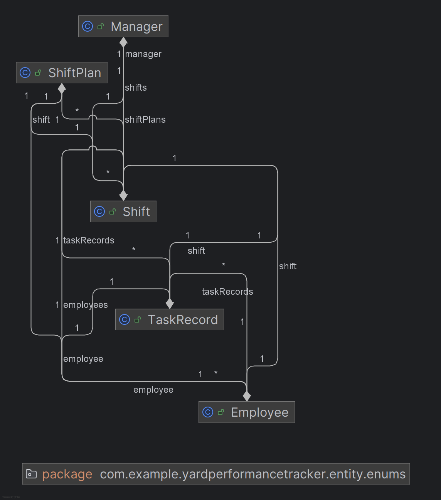

# 🏭 Yard Performance Tracker

**Author:** Sviatoslav Yaroshyk  
**Course:** Ironhack Java + Spring Boot (Amazon Career Choice)  
**Date:** November 2025  

---

## 📘 Project Overview

The **Yard Performance Tracker** is a management system designed to monitor and evaluate warehouse employee performance within the yard department.  
It helps managers track shifts, employee activities, task reports, and operational KPIs in real time.

This application demonstrates how **Spring Boot**, **JPA**, and **MySQL** can be used together to build a clean, structured, and secure backend API for internal operations monitoring.

---

## 🧱 Class Diagram (UML)



The diagram above represents the relationships between core entities:
- `Manager` — supervises shifts and employees  
- `Employee` — performs daily yard tasks  
- `Shift` — individual shift record for a day  
- `ShiftPlan` — scheduled plan containing multiple shifts  
- `TaskRecord` — performance record for specific tasks  

---

## ⚙️ Configuration & Setup

### 1. Database Configuration
Located in `application.properties`:
```properties
spring.datasource.url=jdbc:mysql://localhost:3306/yard_performance_db
spring.datasource.username=root
spring.datasource.password=*******
spring.jpa.hibernate.ddl-auto=update
spring.jpa.show-sql=true
```

### 2. Running the App
```bash
mvn spring-boot:run
```

The app runs by default on:  
👉 **http://localhost:8080**

---

## 🧩 Technologies Used

- **Java 17**  
- **Spring Boot 3**  
- **Spring Security (JWT)**  
- **Spring Data JPA / Hibernate**  
- **MySQL Database**  
- **Postman** for API testing  
- **IntelliJ IDEA Ultimate**  
- **Draw.io / IntelliJ Diagram Tool** for UML visualization  

---

## 🔗 API Structure & Endpoints

### 🔹 Manager Dashboard
`GET /api/dashboard`  
> Returns overview data for current KPIs, total shifts, and performance analytics.

### 🔹 Employee Self View
`GET /api/employee/self`  
> Returns employee’s personal performance and assigned shifts.

### 🔹 Shift Plan
`GET /api/shift-plans/today`  
> Returns today’s active shift plan (if available).  
If the list is empty — it means no plan exists for the current day (normal behavior).

### 🔹 Reports
`GET /api/reports`
> Returns aggregated task and performance reports for the given period.

---

## 📂 Project Structure

```
src/
 └── main/
     ├── java/
     │   └── com.example.yardperformancetracker
     │       ├── config/
     │       ├── controller/
     │       ├── dto/
     │       ├── entity/
     │       ├── mapper/
     │       ├── repository/
     │       ├── service/
     │       └── user/
     └── resources/
         └── application.properties
docs/
 └── class-diagram.png
```

---

## 🧠 Main Features

- JWT-based authentication (Manager / Employee roles)  
- REST API with clear endpoint separation  
- Data persistence with Spring JPA  
- Automatic database schema update  
- Clean service-repository architecture  
- Structured package organization  
- Fully tested endpoints in Postman  

---

## 📊 Future Improvements

- Add front-end dashboard (React or Vue)
- Include real-time KPI updates
- Extend reporting module with export (CSV / PDF)
- Improve authentication UI flow

---

## 💼 Resources & Links

- **GitHub Repository:** https://github.com/Slava938/YardPerformanceTracker
- **Class Diagram:** `docs/class-diagram.png`  
- **Presentation Slides:** https://docs.google.com/presentation/d/1HyLB3p0ilA6kJPK13xhE09c_5L1goyHQQlTny5kUxRY/edit?usp=sharing 

---

## 🙏 Credits

Developed by **Sviatoslav Yaroshyk**  
as part of **Ironhack’s Java + Spring Boot Final Project (Amazon Career Choice Program)**  
November 2025  
“Thank you for your attention!”
